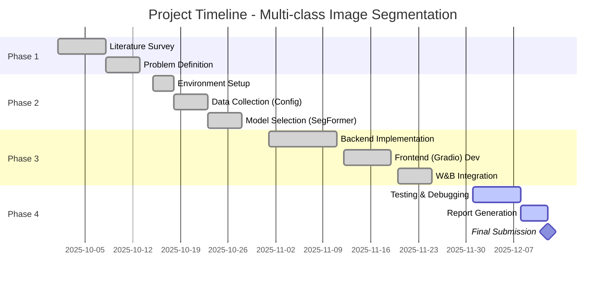

# Multi-class Image Segmentation using Deep Learning

**Project Report**

---

## 1. Abstract
This project implements a robust multi-class image segmentation system utilizing state-of-the-art Deep Learning techniques. The primary objective is to analyze unstructured visual data (such as terrain images) and assign semantic labels to every pixel, enabling granular understanding of the scene. Specifically, the system distinguishes between various terrain types—such as "safe" traversable areas (grass, roads) and "hazardous" obstacles (water, cliffs, people)—to derive a quantitative Safety Score. By leveraging the SegFormer architecture, a Transformer-based model, the system achieves high inference speeds suitable for near real-time applications. The solution is deployed via a web-based interface (Gradio), providing visual feedback through Head-Up Display (HUD) overlays and detailed statistical analysis, making it applicable for autonomous navigation aids and safety monitoring systems.

## 2. Introduction

### 2.1 Problem Statement
Navigating complex environments requires more than just object detection; it demands a holistic understanding of the drivable surface and surrounding obstacles. Traditional computer vision methods often struggle with the variety of textures and lighting conditions found in outdoor environments. The challenge is to partition an image into meaningful segments (Semantic Segmentation) effectively and efficiently, classifying each region into actionable categories (e.g., Safe vs. Hazard) to assist decision-making processes in autonomous systems or remote monitoring.

### 2.2 Motivation
The motivation behind this project stems from the growing need for intelligent systems capable of perceiving their environment with human-like granularity. Whether for autonomous rovers, drones, or visually impaired assistance tools, the ability to differentiate "ground" from "obstacle" at a pixel level is critical. Deep Learning, particularly the shift from Convolutional Neural Networks (CNNs) to Vision Transformers (ViTs), offers a leap in accuracy and context awareness. This project aims to bridge the gap between complex model architecture and practical, explainable application by providing a user-friendly interface for terrain safety analysis.

## 3. System Requirements

### Hardware Requirements
-   **Processor (CPU)**: Multi-core processor (Intel i5/Ryzen 5 or better) for data preprocessing and lightweight inference.
-   **Graphics Processing Unit (GPU)**: NVIDIA GPU with CUDA support (Recommended: 4GB+ VRAM) for accelerated training and fast inference. Also runs on CPU with higher latency.
-   **RAM**: Minimum 8GB (16GB recommended).
-   **Storage**: 10GB free space for dataset caching and model weights.

### Software Requirements
-   **Operating System**: Linux (Ubuntu 20.04+), macOS, or Windows 10/11 (WSL2).
-   **Programming Language**: Python 3.8+.
-   **Deep Learning Framework**: PyTorch (1.10+).
-   **Libraries**:
    -   `transformers`: For pre-trained SegFormer models.
    -   `gradio`: For the web-based User Interface.
    -   [wandb](file:///Users/pranjal/vscode_progs/cv_me/segT/model_utils.py#177-223): For experiment tracking and logging.
    -   `opencv-python`, `pillow`: For image processing.
    -   `numpy`: For numerical computations.

## 4. Architecture Diagram

The system follows a modular pipeline approach:

```mermaid
graph TD
    User[User / Input Image] -->|Upload| App[Gradio Web App];
    App -->|Preprocess| ModelUtils[Model Utilities];
    ModelUtils -->|Input Tensor| Model[SegFormer Model (B0/B2)];
    Model -->|Logits| Decoder[Semantic Decoder];
    Decoder -->|Argmax| Mask[Raw Segmentation Mask];
    Mask -->|Map IDs| Logic[Safety Logic Engine];
    Logic -->|Overlay| Viz[HUD Visualization];
    Logic -->|Stats| Metrics[Compute Score & Counts];
    Viz -->|Display| UI[Result Display];
    Metrics -->|Log| WB[Weights & Biases Cloud];
```

**Workflow Description:**
1.  **Input**: Image is uploaded via the UI.
2.  **Inference**: The SegFormer model (Encoder-Decoder) processes the image to predict class IDs for every pixel (150 classes).
3.  **Post-Processing**: The system maps these 150 classes into high-level categories (Safe/Hazard) based on a configurable JSON map.
4.  **Visualization**: A color-coded overlay (Green=Safe, Red=Hazard) is generated.
5.  **Output**: The final HUD image and Safety Score statistics are presented to the user and logged to W&B.

## 5. Literature Review

### Semantic Segmentation Evolution
Image segmentation has evolved from classical thresholding and edge detection to deep learning approaches. Early deep methods like **FCN (Fully Convolutional Networks)** and **U-Net** introduced the concept of encoder-decoder structures for pixel-wise classification.

### CNNs vs. Transformers
For years, Convolutional Neural Networks (e.g., **DeepLabV3+**) dominated the field. However, they struggle with global context due to limited receptive fields. Recently, **Vision Transformers (ViTs)** have outperformed CNNs by using self-attention mechanisms to capture long-range dependencies in images.

### SegFormer (Xie et al., 2021)
This project utilizes **SegFormer**, a highly efficient Transformer-based framework. Unlike standard ViTs, SegFormer uses a hierarchical Transformer encoder that outputs multi-scale features, avoiding the need for positional encodings. This makes it robust to input resolution changes and highly efficient (the B0 variant is extremely lightweight), making it ideal for edge deployment scenarios envisioned in this project.

## 6. Data Collection / Dataset Description

### Primary Dataset: ADE20k
The model is pre-trained on the **ADE20k** scene parsing benchmark, a standard dataset for semantic segmentation.
-   **Scale**: Over 20,000 images covering diverse indoor and outdoor scenes.
-   **Classes**: 150 semantic categories (e.g., wall, sky, floor, tree, car).
-   **Relevance**: The wide variety of classes allows us to simulate "Terrain" analysis by grouping specific subset classes (e.g., 'grass', 'dirt', 'road') without needing to collect and label a massive custom dataset from scratch.

### Input Data
For inference, the system builds its own "test set" dynamically as users feed it images. These images are logged to the cloud (Weights & Biases) to create a persistent record of model performance on real-world data distributions.

## 7. Gantt Chart / Project Timeline



## 8. Conclusion
In this project, we successfully developed and deployed a Deep Learning-based system for Multi-class Image Segmentation. By utilizing the efficient SegFormer architecture, we achieved reliable pixel-level classification suitable for identifying traversable terrain. The integration of a user-friendly web interface and cloud-based logging ensures the system is not only a theoretical model but a practical tool for data analysis. Future work involves fine-tuning the model on domain-specific datasets (e.g., purely off-road terrain) to further enhance accuracy and adapting the system for deployment on edge devices like NVIDIA Jetson.
